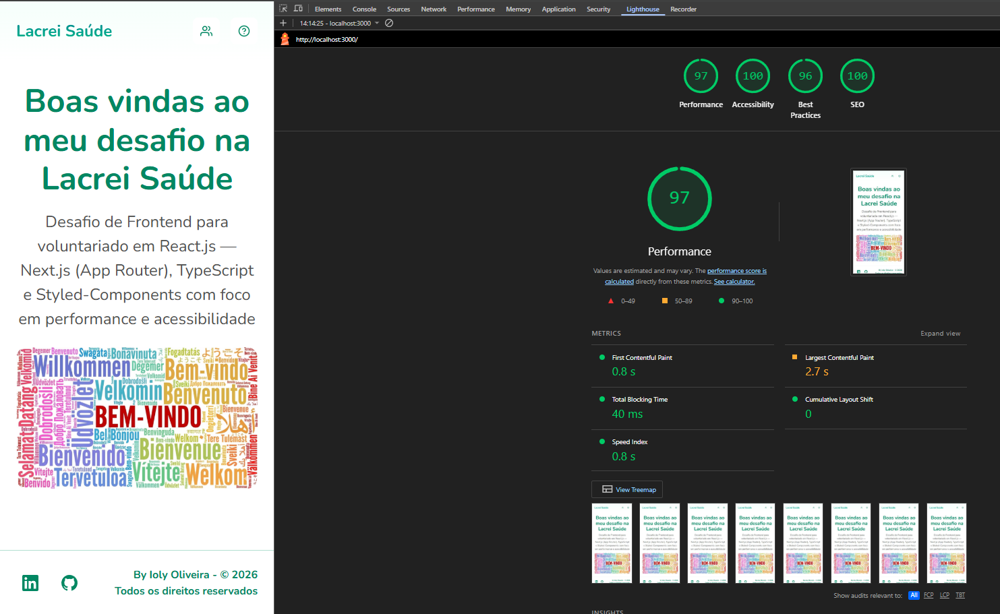
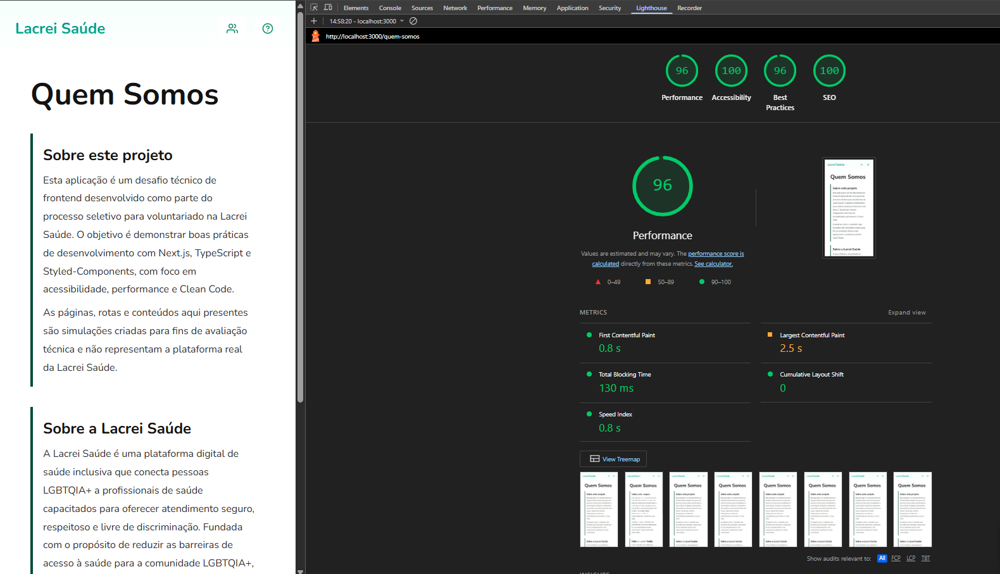
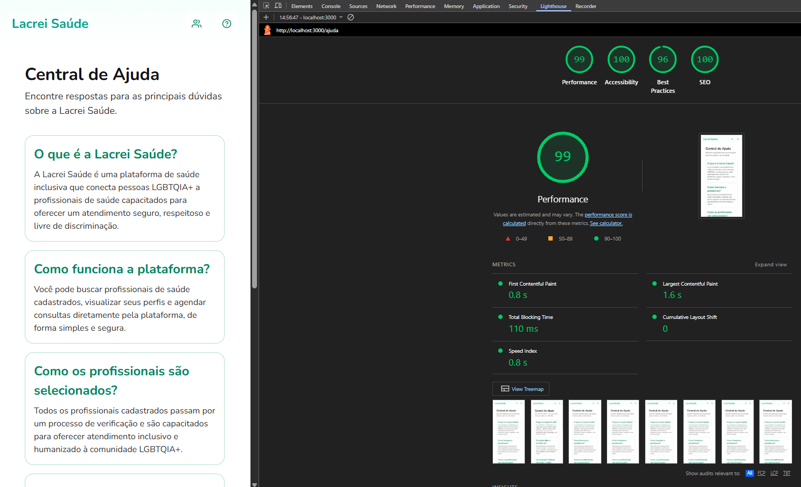

# 🏳️‍🌈 Lacrei Saúde — Desafio Frontend

Desafio técnico de Frontend desenvolvido como parte do processo seletivo para voluntariado na **Lacrei Saúde** — plataforma de saúde inclusiva para a comunidade LGBTQIA+.

<br/>

      

<br/>

## 📑 Índice

- [Sobre o Projeto](#-sobre-o-projeto)
- [Tecnologias](#-tecnologias)
- [Funcionalidades](#-funcionalidades)
- [Arquitetura e Estrutura de Pastas](#-arquitetura-e-estrutura-de-pastas)
- [Como Rodar Localmente](#-como-rodar-localmente)
- [Build e Deploy](#-build-e-deploy)
- [Testes](#-testes)
- [Acessibilidade e Performance](#-acessibilidade-e-performance)
- [Escolhas Visuais e Técnicas](#-escolhas-visuais-e-técnicas)
- [Mock de API](#-mock-de-api)
- [Rollback](#-rollback)
- [Desenvolvedora](#-desenvolvedora)

<br/>

---

## 📌 Sobre o Projeto

Este projeto é uma aplicação web desenvolvida com **Next.js**, **TypeScript** e **Styled-Components**, com foco em:

- Acessibilidade (WCAG 2.1)
- Performance (Core Web Vitals)
- Responsividade mobile-first
- Clean Code e princípios SOLID
- Fidelidade ao **Marsha Design System** da Lacrei Saúde

> ⚠️ As páginas e conteúdos presentes são simulações criadas para fins de avaliação técnica e não representam a plataforma real da Lacrei Saúde. Para conhecer a plataforma oficial, acesse [lacreisaude.com.br](https://lacreisaude.com.br).

<br/>

---

## 🛠 Tecnologias

| Tecnologia                                            | Versão | Uso                            |
| ----------------------------------------------------- | ------ | ------------------------------ |
| [Next.js](https://nextjs.org/)                        | 15+    | Framework React com App Router |
| [TypeScript](https://www.typescriptlang.org/)         | 5+     | Tipagem estática               |
| [Styled-Components](https://styled-components.com/)   | 6+     | Estilização com tema           |
| [Jest](https://jestjs.io/)                            | 29+    | Testes unitários               |
| [React Testing Library](https://testing-library.com/) | 14+    | Testes de componentes          |

<br/>

---

## ✅ Funcionalidades

- **Header** responsivo com navegação por botões e identidade visual da Lacrei Saúde
- **Footer** com links para redes sociais e direitos autorais
- **Página Home** com Hero Section de boas-vindas
- **Página Quem Somos** com contexto do desafio e da instituição
- **Página Ajuda** com FAQ simulando integração com API
- **Página 404** personalizada com CTA de retorno
- **Botão Scroll to Top** flutuante acessível
- **Design System** baseado no Marsha Design System com tema centralizado

<br/>

---

## 📁 Arquitetura e Estrutura de Pastas

### Visão geral

O projeto adota uma arquitetura **feature-based** combinada com uma camada `shared` de componentes e utilitários reutilizáveis. A separação entre `features/` e `shared/components/` é o pilar central da organização:

| Camada               | Responsabilidade                                         |
| -------------------- | -------------------------------------------------------- |
| `app/`               | Roteamento, layouts e Server Components de entrada       |
| `features/`          | Componentes de UI exclusivos de uma página específica    |
| `shared/components/` | Componentes genéricos reutilizáveis em qualquer contexto |
| `shared/styles/`     | Design tokens, breakpoints e estilos globais             |
| `shared/utils/`      | Helpers puros e reutilizáveis                            |
| `services/`          | Camada de dados — isolada dos componentes                |
| `types/`             | Contratos de dados compartilhados                        |

---

### Princípios aplicados

- **SRP (Single Responsibility Principle):** cada componente tem uma única responsabilidade — `Button` lida apenas com o estilo e comportamento do botão; `Header` apenas com a composição da navegação
- **OCP (Open/Closed Principle):** `Button` é extensível via props `variant` e `size` sem alterar sua implementação
- **DIP (Dependency Inversion Principle):** `Header` depende da abstração `Button` e `NavLink`, não de `<button>` e `<a>` diretamente
- **Clean Code:** constantes declarativas (`NAV_LINKS`, `SOCIAL_LINKS`, `FAQ_ITEMS`), props semânticas (`testId`, `ariaLabel`, `priority`) e nenhuma lógica inline nos templates

---

### Fluxo de dados

```
page.tsx (Server Component)
  └── await getFaqItems()         # busca dados no servidor
        └── faqService.ts         # camada de serviço isolada
              └── mocks/faq.json  # fonte de dados simulada
  └── <HelpPage faqItems={...} /> # dados passados como prop
```

Os dados são resolvidos no servidor antes de chegar ao cliente — zero loading state, zero flash de conteúdo.

---

### Estrutura de pastas

```
src/
├── app/                          # Rotas do Next.js App Router
│   ├── layout.tsx                # Layout raiz — Header, Footer e providers
│   ├── page.tsx                  # Página Home (Server Component)
│   ├── not-found.tsx             # Página 404 personalizada
│   ├── ajuda/
│   │   └── page.tsx              # Página Ajuda (async Server Component)
│   └── quem-somos/
│       └── page.tsx              # Página Quem Somos (Server Component)
│
├── features/                     # Componentes exclusivos de cada página
│   ├── About/                    # Seção Quem Somos
│   │   ├── AboutPage.tsx
│   │   ├── styles.ts
│   │   └── index.ts
│   ├── Help/                     # Seção Ajuda com FAQ
│   │   ├── HelpPage.tsx
│   │   ├── styles.ts
│   │   └── index.ts
│   └── NotFound/                 # Página 404
│       ├── NotFoundHero.tsx
│       ├── styles.ts
│       └── index.ts
│
├── shared/
│   ├── components/               # Componentes genéricos e reutilizáveis
│   │   ├── Button/               # Botão com variantes primary, secondary, ghost
│   │   ├── Container/            # Wrapper de largura máxima
│   │   ├── Header/               # Navegação principal
│   │   ├── Footer/               # Rodapé com links sociais
│   │   ├── Hero/                 # Seção hero reutilizável
│   │   ├── IconLink/             # Link com ícone acessível
│   │   ├── Icons/                # Biblioteca de ícones SVG como componentes
│   │   │   ├── ArrowUp/
│   │   │   ├── Favicon/
│   │   │   ├── GitHub/
│   │   │   ├── Help/
│   │   │   ├── LinkedIn/
│   │   │   ├── People/
│   │   │   └── index.ts          # Barrel export
│   │   ├── Logo/                 # Logotipo com suporte a link e priority
│   │   ├── NavLink/              # Link de navegação estilizado
│   │   └── ScrollToTop/          # Botão flutuante de retorno ao topo
│   │
│   ├── styles/
│   │   ├── theme.ts              # Design tokens: cores, tipografia, espaçamento
│   │   ├── media.ts              # Helper type-safe de media queries
│   │   └── GlobalStyle.ts        # Reset e estilos globais
│   │
│   └── utils/
│       └── typography.ts         # Helper para aplicar estilos tipográficos do tema
│
├── services/
│   ├── faqService.ts             # Serviço de dados do FAQ (substituível por fetch real)
│   └── mocks/
│       └── faq.json              # Mock de dados simulando resposta de API
│
└── types/
    └── faq.ts                    # Interface FAQItem — contrato de dados
```

<br/>

---

## 💻 Como Rodar Localmente

### Pré-requisitos

- Node.js 18+
- npm ou yarn

### Instalação

```bash
# Clone o repositório
git clone git@github.com:iolymmoliveira/lacrei-frontend-challenge.git

# Entre na pasta do projeto
cd lacrei-frontend-challenge

# Instale as dependências
npm install
```

### Desenvolvimento

```bash
npm run dev
```

Acesse [http://localhost:3000](http://localhost:3000) no navegador.

<br/>

---

## 🚀 Build e Deploy

### Build de Produção

```bash
# Gera o build otimizado
npm run build

# Roda o servidor de produção localmente
npm run start
```

### Deploy na Vercel

O deploy é feito automaticamente via integração com o GitHub na [Vercel](https://vercel.com):

1. Faça o push para a branch `main`
2. A Vercel detecta automaticamente o projeto Next.js
3. O build é executado e o deploy é publicado

**URL de produção:** [lacrei-frontend-challenge.vercel.app](https://lacrei-frontend-challenge.vercel.app)

<br/>

---

## 🧪 Testes

### Executar os testes

```bash
# Rodar todos os testes
npm test

# Rodar em modo watch (re-executa ao salvar)
npm run test:watch

# Rodar com relatório de cobertura
npm run test:coverage

# Rodar um arquivo específico
npm test Header
```

### Componentes testados

| Componente    | Tipo       | O que é testado                                                   |
| ------------- | ---------- | ----------------------------------------------------------------- |
| `Header`      | Navegação  | Renderização, aria-labels, botões e navegação entre rotas         |
| `Footer`      | Layout     | Links sociais, aria-labels, target `_blank` e copyright           |
| `ScrollToTop` | Interativo | Visibilidade por scroll, clique com scroll suave e acessibilidade |

### Estratégia de testes

- **React Testing Library** com queries por `role`, `label` e `testId`
- Prioridade: `getByRole` > `getByLabelText` > `getByTestId` (conforme guia RTL)
- Mocks de `next/navigation` e `next/link` para isolamento
- Atributos `data-testid` como seletores estáveis nos componentes

<br/>

---

## ♿ Acessibilidade e Performance

### Resultados Lighthouse (build de produção)

| Categoria      | Meta | Resultado  |
| -------------- | ---- | ---------- |
| Performance    | ≥ 80 | **97** ✅  |
| Accessibility  | ≥ 90 | **100** ✅ |
| Best Practices | —    | **96** ✅  |
| SEO            | —    | **100** ✅ |

<br/>

#### 🏠 Home


<br/>

#### ℹ️ Quem Somos


<br/>

#### ❓ Ajuda


<br/>

### Práticas de acessibilidade aplicadas

- HTML semântico: `<header>`, `<main>`, `<footer>`, `<nav>`, `<section>`, `<ul>`, `<li>`
- `aria-label` em todos os elementos interativos sem texto visível descritivo
- `aria-labelledby` vinculando sections aos seus títulos `h1`
- `aria-current="page"` nos links de navegação ativos
- `aria-hidden="true"` em ícones decorativos SVG
- `:focus-visible` com borda azul (`border.focusInfo`) em todos os elementos interativos
- Contraste de cores validado (mínimo 4.5:1 WCAG AA)
- Ordem lógica de headings (`h1` → `h2`)

### Práticas de performance aplicadas

- `priority` na imagem LCP do Hero
- `sizes` otimizado por breakpoint em todas as imagens
- Remoção de `min-height` fixo para eliminar CLS
- `shouldForwardProp` no Styled-Components para evitar props inválidas no DOM
- Formatos `avif/webp` configurados no `next.config`
- `styledComponents: true` no compiler para SSR correto e tree-shaking

<br/>

---

## 🔌 Mock de API

O FAQ da página **Ajuda** simula uma integração com API real:

```
services/
├── mocks/
│   └── faq.json        # Fonte de dados simulada
└── faqService.ts       # Serviço assíncrono simulando fetch
```

O `faqService` expõe uma função `getFaqItems()` que retorna os dados de forma assíncrona — pronta para ser substituída por um `fetch` real sem alterar os componentes consumidores. Os dados são buscados no servidor via Server Component, garantindo zero flash de conteúdo no carregamento.

<br/>

---

## 🔄 Rollback

### Rollback via Vercel (recomendado)

A Vercel mantém histórico de todos os deploys. Para restaurar uma versão anterior:

1. Acesse o [Dashboard da Vercel](https://vercel.com/dashboard)
2. Selecione o projeto
3. Vá em **Deployments**
4. Localize o deploy estável desejado
5. Clique em **Redeploy** → confirme

O rollback é instantâneo e sem downtime.

### Rollback via Preview Deploy

Cada pull request gera automaticamente uma **URL de preview** na Vercel. Isso permite:

- Validar qualquer versão anterior antes de promover para produção
- Compartilhar URLs de preview para revisão
- Reverter simplesmente redirecionando o domínio de produção para um deploy anterior

### Rollback via Git

```bash
# Identifique o commit estável
git log --oneline

# Crie uma branch de hotfix a partir do commit estável
git checkout -b hotfix/rollback <commit-hash>

# Faça o push — a Vercel fará o deploy automaticamente
git push origin hotfix/rollback
```

<br/>

---

## 🎨 Escolhas Visuais e Técnicas

### Design System

O projeto segue fielmente o **Marsha Design System** da Lacrei Saúde, com todos os tokens centralizados em `theme.ts`:

- **Cores:** paleta verde como cor de identidade (`accent: rgba(1, 135, 98, 1)`)
- **Tipografia:** fonte Nunito com escala de `text-xs` a `headline-xl`
- **Espaçamento:** escala semântica com aliases `stack`, `inline` e `inset`
- **Breakpoints:** mobile-first com `tablet: 720px` e `desktop: 1024px`

### Decisões técnicas

| Decisão                                   | Justificativa                                                 |
| ----------------------------------------- | ------------------------------------------------------------- |
| **App Router** do Next.js                 | Server Components nativos, melhor performance e SEO           |
| **Styled-Components** com `ThemeProvider` | Design tokens tipados e acessíveis em todo o projeto          |
| `typography()` helper                     | Evita repetição e garante consistência tipográfica            |
| `media` helper                            | Breakpoints centralizados e type-safe via `theme.breakpoints` |
| `shouldForwardProp`                       | Evita warnings de props HTML inválidas no DOM                 |
| **Server Components** para dados          | FAQ buscado no servidor — sem flash de conteúdo               |
| `NAV_LINKS` como constante                | Declarativo, fácil de estender sem alterar JSX                |
| `data-testid` via prop `testId`           | Seletores estáveis e semânticos para testes                   |
| Ícones como componentes SVG               | Sem dependência externa, tree-shakeable e acessíveis          |

<br/>

---

## 👩‍💻 Desenvolvedora

**Ioly Oliveira**
Desenvolvedora Frontend — Desafio Lacrei Saúde 2026

[](https://www.linkedin.com/in/iolymmoliveira/) [](https://github.com/iolymmoliveira)

<br/>

---

<p align="center">
  Desenvolvido com 💚 para o desafio <a href="https://lacreisaude.com.br">Lacrei Saúde</a>
</p>
